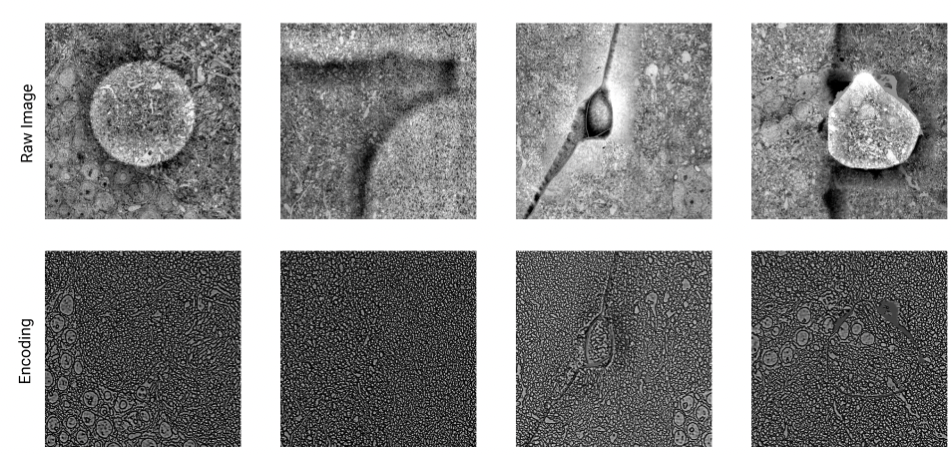

Available Models
================
Denoising Dense Encodings Models 
--------------------------------

Encodings presented in our `manuscript <https://www.biorxiv.org/content/10.1101/2022.03.25.485816v1>`_ suppress visual artifacts in 
EM images while highlighting biological structures. These encodings are helpful both for alignment and for training auxilary models, 
such as fold, crack and plastic detection models. 

We provide several encoder models listed below. 
Encoder models expect normalized image data as input and generalize well accross species and datasets.
Each encoder outputs single channel floating point tensor.
Note that encoding value ranges may differ across scales.

.. list-table:: Encoder Models 
   :widths: 50 25 
   :header-rows: 1

   * - Path 
     - XY Resolution Range
   * - gs://corgie_package/models/encoders/encoder_16_64nm   
     - 16-64nm 
   * - gs://corgie_package/models/encoders/encoder_64_256nm   
     - 64-256nm 
   * - gs://corgie_package/models/encoders/encoder_256_2048nm   
     - 256-2048nm 

Example usage command for an encoder is as follows:

 .. include:: encode_command.rst 

Aligners
--------

Online Finetuner
~~~~~~~~~~~~~~~~~
Online Finetuner uses gradient descent to optimize the alignment field as described in our 
`manuscript <https://www.biorxiv.org/content/10.1101/2022.03.25.485816v1>`_.
Online Fintetunnr can practically correct misalignments up to 2px at the
resolution it's being applied at, and reduce the remaining misalignment to below 0.5px.

Our Online Finetunner alignment model is publically available for use by specifying 
processor path to ``gs://corgie_package/models/encoders/online_finetunner``.
The model operates on ``float32`` normalized images or encodings as input.
Rigidity penalty weight is specified by the ``sm=200`` constructor argument.
Setting ``sm`` to values smaller than 200 will result in less rigid tissue deformations and vice verca.
The number of iterations used by the Online Finetuner is determined by the ``num_iter==2000`` parameter.
Given a good rigidity penalty weight value, Online Fintetuner has been shown to generalize well accross 
species and datasets.

MICrONS Coarse Aligner
~~~~~~~~~~~~~~~~~~~~~~
MICrONS dataset contains particularyly challenging folds of large magnitude.
We release the model that was used to correct these folds, which can be 
used by setting the path to ``gs://corgie_package/models/aligners/MICrONS_aligner_512_1024nm``. 

